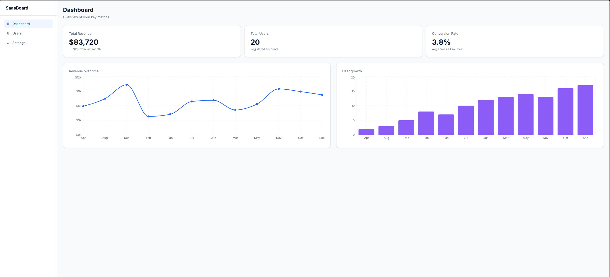
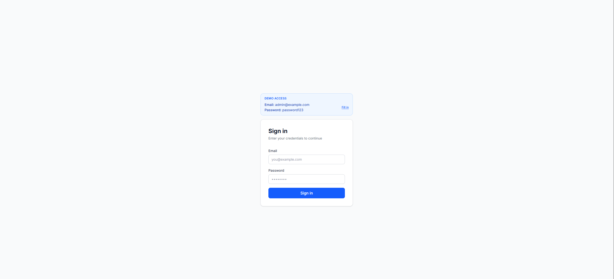
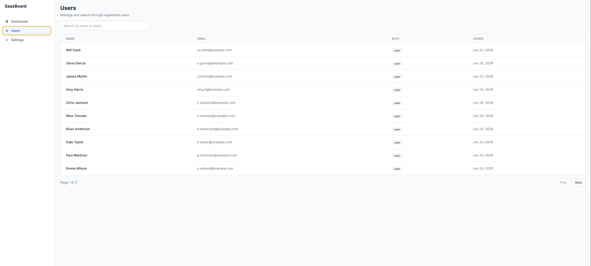

# SaaS Analytics Dashboard

A full-stack analytics dashboard built with Next.js 16, TypeScript and PostgreSQL. JWT auth, interactive charts, user management table with search and pagination.

**Live demo → [your-app.vercel.app](https://your-app.vercel.app)**
Demo login: `admin@example.com` / `password123`



## Features

- Auth with JWT sessions — protected routes via middleware
- Revenue and user growth charts (Recharts)
- Users table with live search and pagination
- Settings page — update name and password
- Deployed on Vercel + Railway PostgreSQL

## Tech stack


## Screenshots




## Run locally

```bash
git clone https://github.com/YOUR_USERNAME/saas-dashboard
cd saas-dashboard
pnpm install
```

Copy `.env.example` to `.env.local` and fill in your values:

```
DATABASE_URL=your_postgresql_url
NEXTAUTH_SECRET=your_secret
NEXTAUTH_URL=http://localhost:3000
```

```bash
npx prisma migrate dev --name init
npx ts-node prisma/seed.ts
pnpm dev
```

Open [http://localhost:3000](http://localhost:3000)

## Project structure

```
app/
├── (auth)/login/        # login page
├── (dashboard)/
│   ├── dashboard/       # charts + KPI cards
│   ├── users/           # users table
│   └── settings/        # account settings
└── api/                 # REST endpoints
components/
├── charts/              # Recharts wrappers
├── tables/              # UsersTable with search
└── ui/                  # Button, Card, Input, Badge
lib/
├── auth.ts              # NextAuth config
└── db.ts                # Prisma client singleton
prisma/
├── schema.prisma        # User + Revenue models
└── seed.ts              # 20 users, 12 months revenue
```
